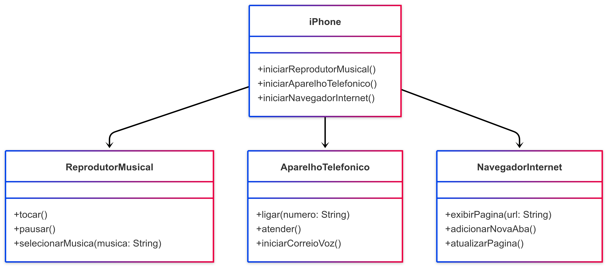

# Projeto iPhone 2007 - DIO

Este projeto modela e diagramas as funcionalidades principais do iPhone de 2007.

## Diagrama UML (Mermaid)

## Funções

O iPhone possui as seguintes funcionalidades principais:

- **Reprodutor Musical**: Tocar, pausar e selecionar músicas.
- **Aparelho Telefônico**: Ligar, atender e iniciar o correio de voz.
- **Navegador na Internet**: Exibir páginas, adicionar abas e atualizar páginas.

